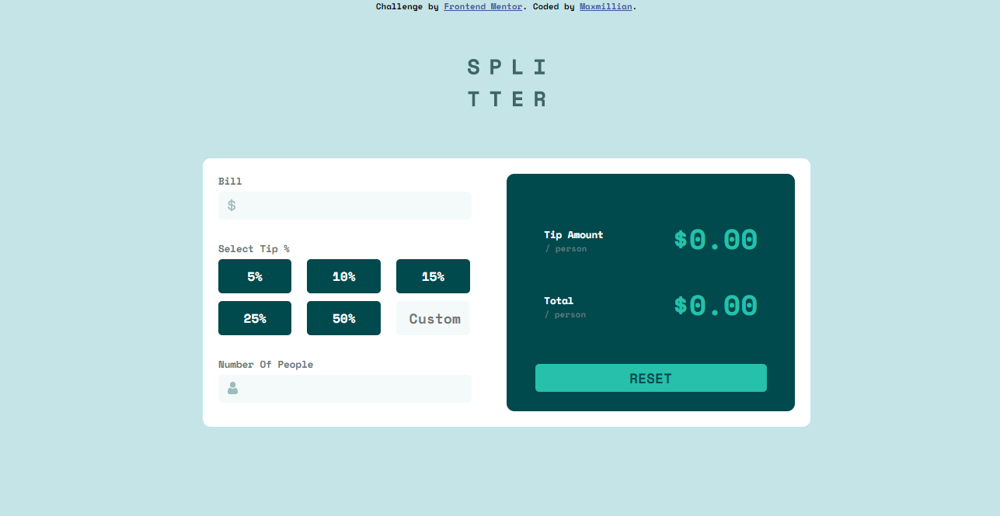
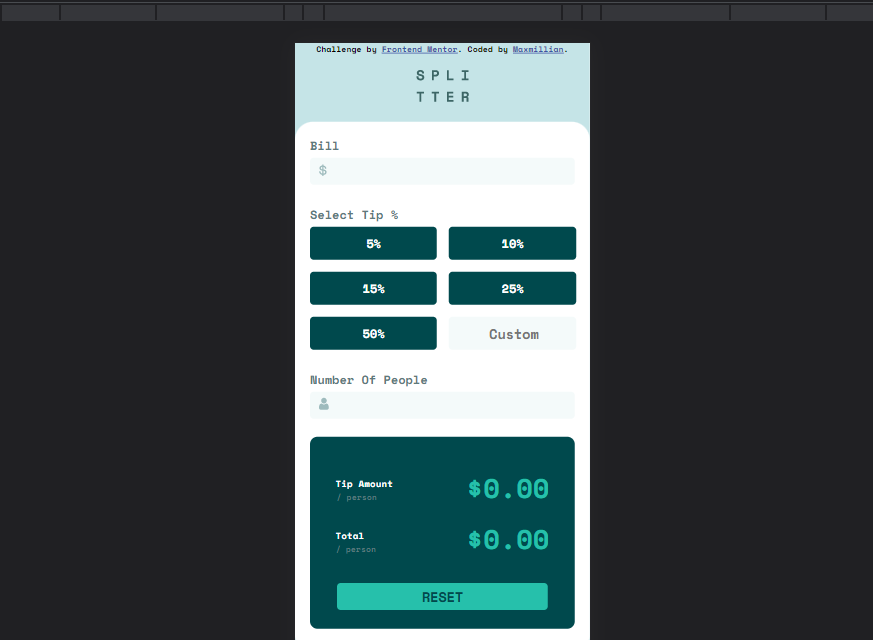

# Frontend Mentor - Tip calculator app solution

This is a solution to the [Tip calculator app challenge on Frontend Mentor](https://www.frontendmentor.io/challenges/tip-calculator-app-ugJNGbJUX). Frontend Mentor challenges help you improve your coding skills by building realistic projects.

## Table of contents

- [Overview](#overview)
  - [The challenge](#the-challenge)
  - [Screenshot](#screenshot)
  - [Links](#links)
- [My process](#my-process)
  - [Built with](#built-with)
  - [What I learned](#what-i-learned)
  - [Continued development](#continued-development)
  - [Useful resources](#useful-resources)
- [Author](#author)

## Overview

### The challenge

Users should be able to:

- View the optimal layout for the app depending on their device's screen size
- See hover states for all interactive elements on the page
- Calculate the correct tip and total cost of the bill per person

### Screenshot




### Links

- Solution URL: (https://github.com/MaxKolbe/Tip-Calculator)
- Live Site URL: (https://maxkolbe.github.io/Tip-Calculator/)


## My process

### Built with

- Semantic HTML5 markup
- CSS custom properties
- Flexbox
- CSS Grid
- Mobile-first workflow
- Vanilla Javascript

### What I learned

Throughout the process of building this project I ended up learning a lot of things, and I will group my learnings into two categories: the html/css and Javascript. 

#### HTML & CSS

- I learnt the basics of css-grid
- I learnt to refresh forms using the .reset() method
- I learnt to prevent refreshing the page on the click of a button using the " type = button " attribute in the button tag
- I learnt to combine both the css-grid and flexbox displays to create a responsive web design
- I learnt to use multiple media-queries 

```html
<h1>Some HTML code I'm proud of</h1>
<button type="button" class="btn">50%</button>
```
```css
.tip-box input[type = text]:focus{

}
```
#### Javascript

- I learnt to properly use the forEach to add event listeners to my buttons
- I learnt to validate forms properly with if statements
- I learnt to break out of a function with an if statement
- I learnt to make proper use of string methods
- I learnt to round up numbers using the .toFixed() method

```js
var button = document.querySelectorAll(".btn")

button.forEach((btn)=>{
  btn.addEventListener("click", (e)=>{
    const number = e.currentTarget.innerHTML
    const realNumber = number.slice(0,2)
    const alsoRealNumber = parseInt(realNumber)

    const bill = document.getElementById("bill").value
    const people = document.getElementById("people").value
      
    const bills = parseInt(bill)
    const peoples = parseInt(people)

    const showAmount = document.getElementById("tipAmt")
    const showTotal = document.getElementById("totPsn") 

    let tip = ( (alsoRealNumber / 100) * bills) / peoples
    let total = ( (tip * peoples) + bills ) / peoples

    if (bill.length == 0 || people.length == 0) {
      return
    }
    
    showAmount.innerHTML = `$${tip.toFixed(2)}`
    showTotal.innerHTML = `$${total.toFixed(2)}`

  })
})

```

### Continued development

- More on Css grid
- More on Javascript fundamentals 

### Useful resources

- [W3Schools](https://www.w3schools.com//) - This helped me to refresh on string methods
- [Tutorials Point](https://www.tutorialspoint.com/How-to-reset-or-clear-a-form-using-JavaScript) - This is helped me find out how to refresh a form

## Author

- Frontend Mentor - [@MaxKolbe](https://www.frontendmentor.io/profile/MaxKolbe)


